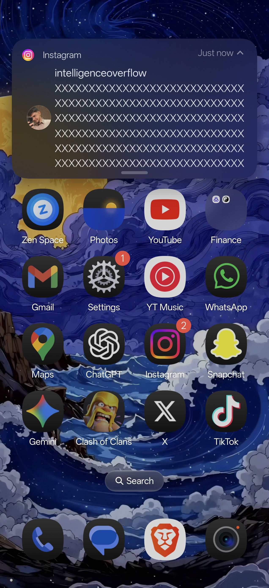
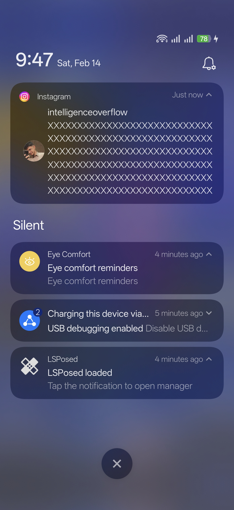
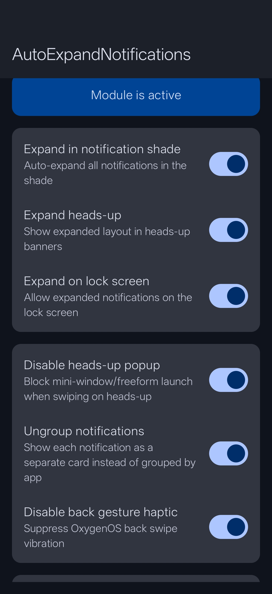

# AutoExpandNotifications

Notification & System Tweaks for OxygenOS

---

## About

An LSPosed/Xposed module that enhances notification behavior on OnePlus devices running OxygenOS. Auto-expand notifications everywhere, block accidental popup launches from heads-up swipes, and disable the back gesture vibration.

## Screenshots

| Expanded Heads-Up | Notification Shade | Settings |
|---|---|---|
|  |  |  |

## Features

### Auto-Expand in Notification Shade
Automatically expand all notifications when you pull down the notification shade. See full message text and action buttons (Reply, Mark as read, Mute) without tapping each notification.

### Auto-Expand Heads-Up Notifications
Incoming notification banners at the top of your screen arrive fully expanded. See the complete message and action buttons immediately. Swipe down to collapse, swipe down again to expand.

### Auto-Expand on Lock Screen
Notifications on the lock screen appear expanded by default, showing full content. Can be disabled for privacy.

### Disable Heads-Up Popup
Prevents the mini-window/freeform launch when swiping down on a heads-up notification. Instead, swiping down toggles between expanded and collapsed views.

### Mute Back Gesture Haptic
Disables the vibration feedback when using the back swipe gesture, while keeping all other haptic feedback intact.

### App Exclusion List
Choose specific apps whose notifications should NOT be auto-expanded. Exclusions apply across all three notification modes (shade, heads-up, and lock screen).

## Requirements

- OnePlus device running **OxygenOS 16** (Android 16)
- **Root access** (Magisk / KernelSU / APatch)
- **LSPosed** framework (Irena or compatible fork)
- **Zygisk** enabled

## Installation

1. Download the latest APK from [Releases](https://github.com/kvmy666/-AutoExpandNotifications/releases)
2. Install the APK
3. Open **LSPosed Manager** > Modules > Enable **AutoExpandNotifications**
4. Ensure **System UI** is checked in the module scope
5. **Reboot** your device
6. Open the app to configure features

## Tested On

| Device | OS Version | Status |
|---|---|---|
| OnePlus 15 | OxygenOS 16.0.3.501 (Android 16) | Fully Working |

> **Note:** This module was built and tested specifically for OxygenOS 16. It may work on other OxygenOS versions or OnePlus devices, but compatibility is not guaranteed. Contributions to support more devices are welcome!

## FAQ

**Q: Do I need to reboot after changing settings?**
A: Yes, a reboot is required for toggle changes to take effect since hooks are loaded at boot time.

**Q: Will this cause a bootloop?**
A: The module uses extensive error handling (try-catch on all hooks). If something fails, it fails silently. However, it's always recommended to have bootloop protection in place.

**Q: Can I use this with Oxygen Customizer?**
A: Yes, they should work together without conflicts since they hook different parts of SystemUI.

## Contributing

Contributions are welcome! If you've tested this on a different OnePlus device or OxygenOS version, please open an issue to report compatibility.

## Contact

- Telegram: [@kvmy1](https://t.me/kvmy1)

## License

This project is licensed under the GPL-3.0 License - see the [LICENSE](LICENSE) file for details.

## Disclaimer

This module modifies SystemUI behavior through Xposed hooks. While extensively tested, I am not responsible for any issues that may arise from using this module. Always maintain a backup and have bootloop protection in place.
